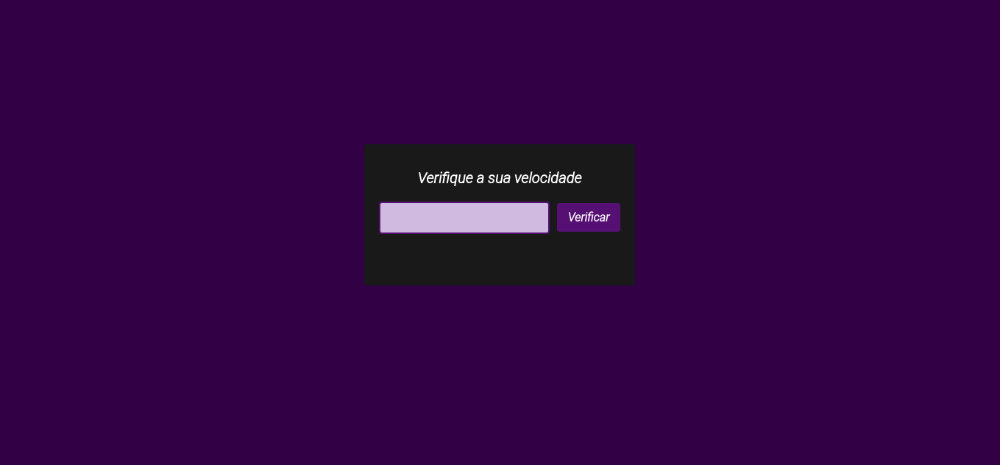

Dirija com moderação.

Este app tem a função de multar ou parabenizar o condutor baseando-se na velocidade em que o condutor está andando com a sua viatura.

MODO DE USO:

É só digitar o número da velocidade da viatura no input e clicar no botão de verificar, e ele mostrará o resultado.

 <h1 align = center>
    
</h1>